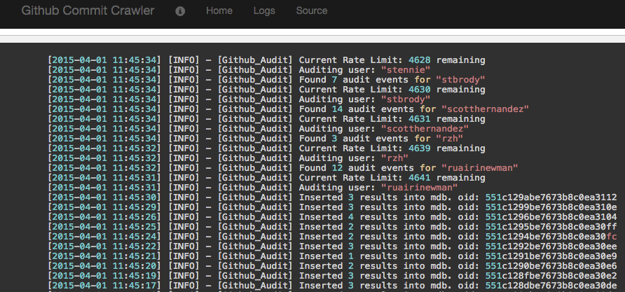
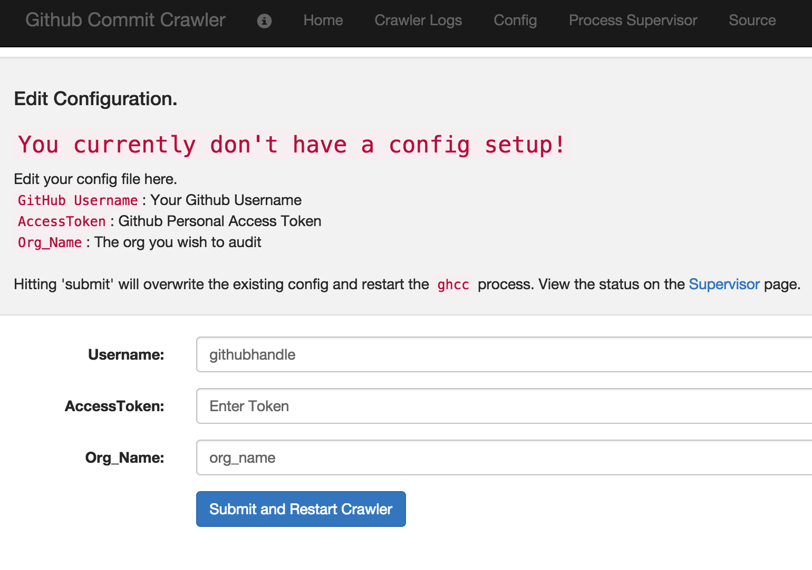

# GitHub Commit Crawler

## What is this?

The GitHub Commit Crawler (ghcc) is a tool that enumerates members of a github organization, looks for their public commits and parses those commits for keywords/regexes that may contain sensitive information (e.g., API keys).

To make this easier to use and quicker to setup, we shoved everything in a docker container.

The crawler process is intended to be run at regularly intervals (ie, every 30 minutes).

## How do I view the results?

The main `ghcc.py` script simply inserts results into a MongoDB collection. We provide a thin web app to view the results and do other related tasks (like edit the config, supervise the processes, etc).

Within MongoDB, the document looks like:

```js
{
  "_id": ObjectId("54a6f232a0b7f9f39eb749b0"),
  "blob": "https://github.com/jfalken/audit_test/blob/e69279825940f4a562300f75f00dab864a91bd1e/audit_test2.txt",
  "audit_date": ISODate("2015-01-02T19:32:01.992Z"),
  "commit_url": "https://api.github.com/repos/jfalken/audit_test/commits/e69279825940f4a562300f75f00dab864a91bd1e",
  "uid": "jfalken-2490741299",
  "author": "jfalken",
  "matched": "BEGIN RSA PRIVATE KEY",
  "html_url": "https://github.com/jfalken/audit_test/commit/e69279825940f4a562300f75f00dab864a91bd1e",
  "string": "@@ -1,2 +1,2 @@\n-BEGIN RSA PRIVATE KEY\n+BEGIN RSA PRIVATE KEY2\n sample.\n\\ No newline at end of file"
}
```

And the web app that views the results provides basic links and pagination for the results:


Hitting the 'Diff' button will show just the patch and highlight the found keyword.


Logs are written to a logfile. In order to view this more easily when run from Docker, you can view the logs from the app:



## Installation

To ease installation and trial usage, we've created a Dockerfile that will package up ghcc, mongodb and its viewer all-in-one. When started, the container uses supervisord run mongodb, the crawler and a gunicorn application server to run the viewer web app.

From the web app, you can view the supervisord status for each process, and restart those processes if needed. Additionally, the config file can be edited directly from the web ui, so there is no need to adjust files 

### Pre-Req

This script requires a Github [personal access token](https://github.com/blog/1509-personal-api-tokens) that has the following permissions:

`read:org` - to read members in an organization.

This token can be created in Github under Settings > [Personal Access Tokens](https://github.com/settings/tokens)

Note: the user must be a member of the organization you are trying to audit.

When you run start the app, it'll ask you for this info.

### Installation Process

#### Installation via Dockerhub


[Dockerhub Link](https://registry.hub.docker.com/u/jfalken/github-commit-crawler/) 

First, pull Dockerfile from Dockerhub

```
docker pull jfalken/github-commit-crawler
```

Then, run the image to create a container, mapping a local port (5000) to the container's exposed port (5000)

```
docker run -d -p 5000:5000 jfalken/github-commit-crawler
```

### Installation via Dockerfile

If you installed via DockerHub, skip this section as your image is already built - scroll down to `Connecting`.

You can `git clone git@github.com:10gen/github_commit_crawler.git`

Alternatively, download the zip from Github and extract it to wherever you want.

### Edit Keywords (optional)

Edit the file `ghcc_process/libs/keywords.py`, to include any additional keywords you want to search for. These keywords are case insensitive. Its a good idea to include keywords that are company sensitive and likely should not exist in a public repo. 

1. Docker needs to be installed, see [docker installation guides](https://docs.docker.com/installation/)
2. Build the Docker Image
   
   From the directory with the `Dockerfile`, `sudo docker build -t jfalken/ghcc .`
   
   You can use a different tag (-t) if you wish.
   
   This will build the image; it should take a few minutes. The output should look like:
   
   ```bash
Sending build context to Docker daemon
Step 0 : FROM mongo:latest
Step 1 : MAINTAINER jfalken <chris.sandulow@gmail.com>
Step 2 : RUN apt-get update && apt-get upgrade -y && apt-get install -y python   python-dev   python-distribute   python-pip   libyaml-dev   supervisor &&   easy_install -U pip
Step 3 : ADD /ghcc_process ghcc_process
Step 4 : ADD /viewer_process viewer_process
Step 5 : ADD /config ghcc_process/config
Step 6 : RUN pip install -r ghcc_process/requirements.txt
Step 7 : EXPOSE 5000
Step 8 : COPY supervisord.conf /etc/supervisor/conf.d/supervisord.conf
Step 9 : CMD /usr/bin/supervisord
Successfully built 1eed6b7b7c1f
```

3. You can list the docker images you have with `sudo docker images`:

   ```bash
$ sudo docker images

REPOSITORY          TAG                 IMAGE ID            CREATED             VIRTUAL SIZE
jfalken/ghcc       latest              1eed6b7b7c1f        23 minutes ago      705 MB
```

   Note the IMAGE ID from above; once you RUN this image, it will create a container.

4. Run the image to create a container

   ```bash
$ sudo docker run -d -p 5000:5000 1eed
```

   We use `-d` to detach the container and let it run in the background

   We use `-p 5000:5000` to map `:5000` on the localhost to the exposted port `:5000` of the container
   and lastly `1eed` is the image id we wish to run; note we don't need to use the full ID. Just something that is unambiguous.

We can confirm this is running with `sudo docker ps`

```bash
$ docker ps

CONTAINER ID        IMAGE                  COMMAND                CREATED             STATUS              PORTS                                        NAMES
081c48ef6468        jfalken/ghcc:latest   "/entrypoint.sh /usr   3 seconds ago       Up 2 seconds        27017/tcp, 5000/tcp, 0.0.0.0:5000->500/tcp   gloomy_davinci
```

#### Connecting 

This is now running; you can connect to the web UI via the exposed port; that is `http://localhost:5000`. If you are using `boot2docker`, you need to find the local IP via `boot2docker ip`

#### Initial Config

When you first start the Docker container and navigate to the web ui, it will present you witht the config screen:



Follow the instructions on screen; add your `username`, `personal access token` (created earlier) and `GitHub org Name`, then submit. This will update the config file, restart the crawler process. Then check out 'home' for the results, or 'Crawler Logs' to see the process.

#### Installation on Windows and OS X

If you are using Docker on Windows or OSX, you have to use boot2docker. Details on how to configure and get it running is outside the scope of this document. A few things to keep in mind when doing this:

1. You won't need to preface all docker commands w `sudo`.
2. To access the web interface, it won't be `localhost`, it will be the IP of the boot2docker VM. This can be found with `boot2docker ip`.


### Python

The Dockerfile and Docker container is intended for eval purposes. You could run this in a prod environment using Docker, but we currently use a python virtualenv w/ gunicorn to run the applicatio nativleu.

1. Setup a host w/ MongoDB running
2. Create a virtual environment
3. Install pre-req via `pip install -r requirements.txt`.
4. Setup cron to execute `ghcc.py` at whatever frequency you'd like.

Results will go into you local mongodb database.

## Limitations and TODOs

* This only looks at _public_ events - if you want to audit commits to private repos, we don't do that yet.
* Only the last 300 commits are checked, we don't go back furhter in time. This tool is intended to be run fairly frequently (we run every 30 minutes)
* Check out [Gitrob](https://github.com/michenriksen/gitrob), a similar tool with a much prettier interface.
* We only check push_events. Not others, yet
* We don't look at public gists yet.

## Contributing and Issues

For issues, please open a GitHub issue.

To contribute, please fork and submit a PR.

## Troubleshooting and Misc

* We realize we're shoving a ton of stuff into a single Docker container and this is against the Docker philosophy. We do this for ease-of-use demo purposes. For prod use, you should probably run the python scripts by themselves. Or if someone wants to properly Dockerize this, that would be helpful.

* There is a locking mechanism so that multiple runs of `ghcc` won't overlap. If for some reason the script crashes (or you prematurely stop the docker container before a run is complete) and the lock is not released, you can use the `remove_lock.py` script to forcefully remove the lock. Do something like:

	```js
	(default)chris:/ $ docker exec 031b /ghcc_process/remove_lock.py
	(default)chris:/ $ docker stop 031b
	(default)chris:/ $ docker start 031b
	```

	Where `031b` is the conatiner ID. This will remove the lock, then restart all the things.

* GitHub permits 5,000 API calls per token per hour. In an org of about ~300 users, we are able to run `ghcc` every 30 minutes and not hit that limit. If you have a larger org, you may want to run it less frequently. We don't support using multiple tokens across a distributed workload, as I believe this is a violation of Github's terms.

* Docker Gotchas:
 - We log to a file, not STDOUT. So `docker logs` won't work like it should. This is why the web app has a log viewer.
 - The crawler runs once when conatiner starts, and it runs once. If u want this run continously, you could stop/start the container every X minutes via an external process, or modify the ghcc scripts.

* We dont do deduplication on anything. So you'll see multiple hits on the same file if multiple keywords match.

## Contributing

Issues should be created using GitHub issues. If you have an addition, please fork and submit a pull request.

## License 

Copyright 2015 Chris Sandulow

Licensed under the Apache License, Version 2.0 (the "License");
you may not use this file except in compliance with the License.
You may obtain a copy of the License at

    http://www.apache.org/licenses/LICENSE-2.0

Unless required by applicable law or agreed to in writing, software
distributed under the License is distributed on an "AS IS" BASIS,
WITHOUT WARRANTIES OR CONDITIONS OF ANY KIND, either express or implied.
See the License for the specific language governing permissions and
limitations under the License.
+
